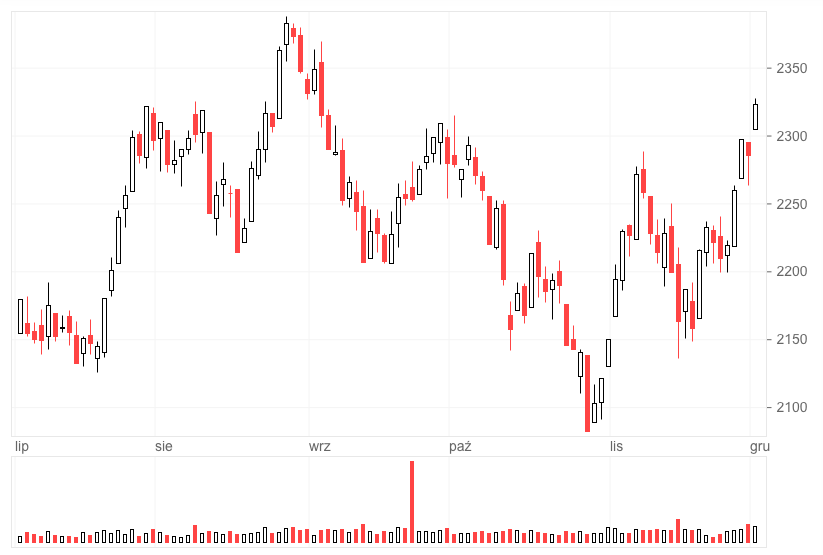
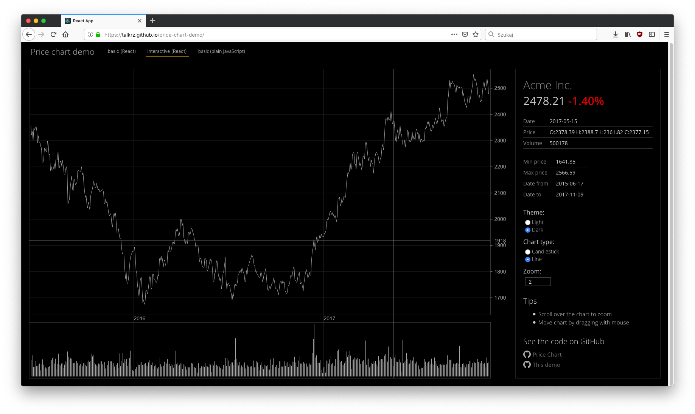
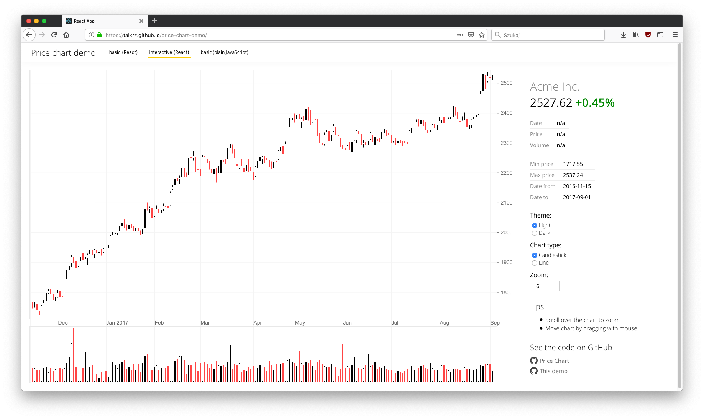

# price-chart

Simple, lightweight, zero-dependency, canvas-based library for drawing candlestick price charts

## Online demo

This demo includes both React and vanilla JS examples:
https://talkrz.github.io/price-chart-demo/

## Play with the code on CodeSandbox
https://codesandbox.io/s/pxx9l9oz0

## Screenshots





## Usage

### Minimal example without user interactions

Include the library in your HTML document:
```html
<script src="https://unpkg.com/@talkrz/price-chart@latest/dist/price-chart-umd.min.js"></script>
```

Make canvas elements to draw the chart on:
```html
<div id="Root">
  <div id="ChartContent" class="Chart">
    <canvas id="ChartCanvasContent" class="Chart-canvas">
    </canvas>
    <canvas id="ChartCanvasScale" class="Chart-canvas-scale">
    </canvas>
  </div>
</div>
```

Position the canvas layers one on top the other:
```css
#Root {
  width: 100%;
  height: 100vh;
  display: flex;
}

.Chart {
  position: relative;
  flex-grow: 1;
}

.Chart-canvas {
  position: absolute;
  top: 0;
  left: 0;
  z-index: 0;
}

.Chart-canvas-scale {
  position: absolute;
  top: 0;
  left: 0;
  z-index: 1;
}
```

Draw the chart:
```javascript
// create HTML elements references
const content = document.getElementById('ChartContent');
const base = document.getElementById('ChartCanvasContent');
const scale = document.getElementById('ChartCanvasScale');

// set chart dimensions
// in this case the content HTML element dimensions
const width = content.offsetWidth;
const height = content.offsetHeight;

// define drawing layers, minimum 2 layers are required
// one for drawing price and volume
// and other for scale
const layers = {
  base: base,
  scale: scale
};

// prepare chart view
const chartState = {
  width,
  height,
  zoom: 8,
  offset: 0,
  // you can modify the config and theme objects
  // but here we just use the default ones
  config: PriceChart.chartDefaultConfig(),
  theme: PriceChart.chartThemes()['light'],
}

PriceChart.chartInit(
  data,
  layers,
  chartState
);

// draw chart
PriceChart.chartDraw();
```

## Release new version

1. Update version in package.json
2. Update CHANGELOG.md file
3. Run:
  ```
  # This command will fail if tests don't pass
  npm run release
  ```
4. Execute commands printed by it
